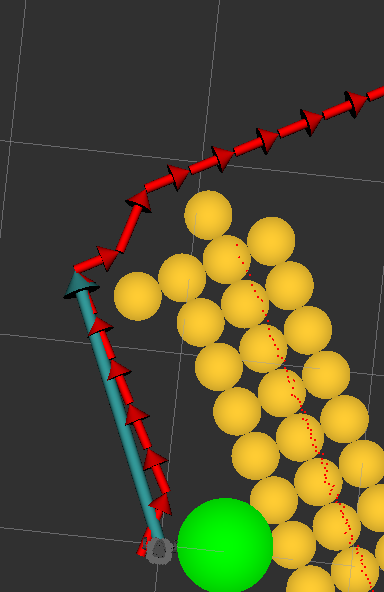

# Tier 4 Final Project

The robot is navigated through obstacles to collect all goals provided by the goal publisher.

## Getting Started

These instructions will get you a copy of the project up and running on your local machine for development and testing purposes.

### System

Install Ubuntu 18.04 on VM or on native system. https://releases.ubuntu.com/18.04.5/

### ROS

Follow the [guide](http://wiki.ros.org/melodic/Installation/Ubuntu) to install ROS Melodic on Ubuntu.

Install turtlebot3 for ros melodic.
```
sudo apt-get install ros-melodic-turtlebot3 ros-melodic-turtlebot3-simulations ros-melodic-turtlebot3-teleop
```

### Catkin workspace

Create a catkin workspace.
```
mkdir -p ~/catkin_ws/src
cd ~/catkin_ws/src
catkin_init_workspace
cd ~/catkin_ws
catkin_make
echo "source ~/catkin_ws/devel/setup.bash" >> ~/.bashrc
source ~/.bashrc
```

### Clone this project

Clone this repository into the `src` folder within the catkin workspace.
```
git clone https://fbe-gitlab.hs-weingarten.de/stud-amr/2020-ws-bachelor/je-171731_tier4.git ~/catkin_ws/src/
```

## Up and Running

Start roscore in a separate terminal.
```
roscore
```

Launch gazebo with the turtlebot3 in an empty world in another separate terminal.
```
roslaunch turtlebot3_gazebo turtlebot3_empty_world.launch
```

Spawn the obstacles located in `final_project_practice/model.sdf`.
```
rosrun gazebo_ros spawn_model -file ~/catkin_ws/src/je-171731_tier4/final_project_practice/model.sdf -sdf -x 2 -y 1 -model final_project
```

Launch the goal publisher. To specify custom goal points and rewards, you can modify the goal config located in `final_project_practice/practice_goals.yaml`.
You have to specify the full path as argument for the `config_file`. So change the directory accordingly.
```
roslaunch goal_publisher goal_publisher.launch config_file:=/home/user/catkin_ws/src/je-171731_tier4/final_project_practice/practice_goals.yaml
```

Finally, launch the robot navigation (this project).
```
roslaunch je_171731_prj start.launch
```

### Alternative for development

You can start the goal publisher and the robot navigation at once using the `start_local_dev.launch` launch file.
```
roslaunch je_171731_prj start_local_dev.launch
```

## General description

The goal of this project is to navigate the turtlebot3 through the obstacles and collect the goals provided by the goal publisher.
The goal publisher sends goal positions with rewards.
The robot has to decide which goal it is heading for.
Then he has to navigate to this goal position without touching an obstacle.
A goal is collected when the robot is within the range of 50cm.
After the robot has collected a goal, he has to decide again which goal it is heading for next and then navigate to the next goal until all goals are collected.

### Used topics

| | |
|---|---|
| /scan | The laser scan topic is used to detect obstacles. The robot permanently scans its surrounding and publishes the measured laser ranges. |
| /gazebo/model_states | The model states topic is used to get the exact robot position and rotation. The exact position and rotation is needed to reference the goal positions, for example to decide if a goal is in range to collect. |
| /odom | The odometry topic is used for relative obstacle detection. This allows the robot to remember obstacles outside of its range. Note that the odometry is inaccurate. |
| /cmd_vel | The velocity command topic is used to control and move the robot. |
| /goals | The goals topic is used to receive goal positions and rewards. |
| /visualization_marker | The visualization marker topic is used to visualize what the robot is currently seeing and doing. |

### Components

#### start_robot_navigation

Here is the entry point for the robot navigation which should be started by a launch file.
It initializes the ros node and then continuously updates the robot_navigation component until a shutdown request is received.

#### robot_navigation

This is the heart of the robot navigation where all components are combined to work together and successfully navigate the robot to all goals.
It updates the grid and the goals, gets the selected goal and finds the path for the selected goal and controls the robot along the path.

#### robot_state

The robot state keeps track of the currently measured laser scans, the current exact position and rotation in the world and the proximal position and rotation.
The exact position and rotation should only be used to reference the goal positions. 
For example, this is needed to detect if a goal is in range of the robot to collect the goal.
The proximal position and rotation is specified by the movement of the wheels. Therefore, this position is not precise as the robot drifts.
This can be used to relatively detect obstacles and move the robot.

#### robot_control

This component is responsible for the movement of the robot control.

#### grid

The grid component detects obstacles using the measured laser scans. When an obstacle point is measured the according grid cell is marked to contain an obstacle.
The grid also contains functions to get nearby grid positions without an obstacle and to detect if an obstacle crosses a given line.

#### goal

The goal component receives the published goals on the `/goals` topic and stores them in an object pool.
This component stores the state of a goal, whether a goal was collected or is unreachable.
It also checks if a goal is in range to collect and then prints the collected goal and the total collected reward.

#### goal_selector

This component selects the best goal to target. It uses the nearest neighbor algorithm where a near neighbor depends on the path length and the reward.

#### path_finder

This component finds the best path to a grid position. It avoids the obstacles and finds the shortest path on the grid by using the A* algorithm.

#### marker_drawer

The marker drawer is useful to visualise what the robot is currently seeing and doing.
It draws the goals in different colors, to see which one is selected, collected, uncollected or unreachable.
It also draws the obstacles on the grid.
Further, it draws the current path to the selected goal and the direction the robot is moving to.

#### manual_control

The manual control component is useful for development. It allows to move the robot forward, backwards, left and right.
You can type `wasd` to provide the action and send the movement command with enter. 
It is also possible to combine actions like forward, left by providing `wa`.

### Algorithm

#### Background processes

When a new message on an topic is received, the according data is updated directly in its thread.
This concerns the measured laser scan data, the exact and proximal position and rotation, and the goals.
The algorithm described below uses these data to navigate the robot.

#### Main robot navigation loop

The navigation algorithm runs in an endless loop until a shutdown request is received.

1. Wait until all necessary data were received by the robot state.
2. Update the grid to detect obstacles.
    1. Loop through every measured laser scan and do the following.
    2. Ignore laser scans with the value of `infinity`.
    3. Calculate the angle of the current laser scan.
    4. Convert the polar coordinate of the laser scan hit to cartesian coordinate relative to the proximal position of the robot.
    5. Convert the laser scan hit position to its grid position.
    6. Store the grid position as an obstacle in a set.
3. Check the goals if any is in range.
If a goal is in range, set the collected state to true and print a message including the total collected reward.
4. Select the best goal by using the nearest neighbor algorithm which considers the path distance and the reward.
    1. Store the best goal and its distance reward in a variable.
    2. Loop through every uncollected, reachable goal.
    3. Check if the current goal is a candidate to beat the best goal.
        1. Calculate the maximal direct distance the goal can have (best_distance_reward * reward).
        2. Check if the direct distance is greater than the calculated maximal direct distance.
        If this distance is greater, this goal is not a candidate and continue with the next goal.
    4. Find a grid position for the selected goal (see 6.). If no grid position could be found, continue with the next goal.
    5. Find a path to the grid position of the goal (see 8.). If no path could be found, continue with the next goal.
    6. Calculate the path distance by summing up the distances between each path position.
    7. Calculate the distance reward for the goal (path_distance * (1.0 / reward)).
    8. If the distance reward is lower than the best goal distance reward, replace the best goal and its distance reward with the current goal.
5. If no goal could be selected, stop the robot and continue the main loop.
6. Find a grid position for the selected goal.
    1. Convert the goal position to the grid position.
    2. If there is no obstacle on the grid position, use this grid position.
    3. Put the grid position in a queue.
    4. Loop through the queue until it is empty.
    5. Check if there is an obstacle on the current grid position. If there is no obstacle, use the current grid position.
    6. Expand the neighbors of the current grid position which are within the radius to the origin.
    7. Add the neighbors to the queue which weren't in the queue yet.
7. If no grid position could be found, set the goal as unreachable, stop the robot and continue the main loop.
8. Find a path for the selected goal using the A* algorithm.
    1. Convert the robot proximal position to the grid start position and set the end position to the selected goal grid position.
    1. Store an open list using a min heap which contains all open positions. Add the start position with weight 0 to the open list.
    2. Store the parents of a node.
    3. Store the g scores which contain the real distance to a grid positions. Add the start position with the g score of 0.
    4. Store the f scores which contain the real distance to a grid position plus the estimated distance to the end. Calculate the heuristic for the start position and add it to the f scores.
    5. Loop through the open list until it is empty.
    6. Get the position with the lowest f score from the open list and remove it from the open list.
    7. Check if the current position is the end position. If it is the end position, reconstruct the path using the parents and return the path.
    8. Expand the children of the current position with the according score. A direct neighbor has an additional score of +1, a diagonal neighbor has an additional score of +1.5.
    9. Loop through every children.
    10. Calculate the g score of the child.
    11. If the calculated g score is lower than the stored g score or if the stored g scores does not contain the child yet, do the following. Otherwise continue with the next child.
    12. Update the parents and link the child to the current position.
    13. Update the g score of the child in the stored g scores.
    14. Calculate the heuristic of the child.
    15. Update the stored f scores with the g score of the child plus the heuristic.
    16. If the open list does not contain the child, add the child to the open list with the weight of its f score.
    17. If the open list is empty and no path could be found yet, return an empty path.
9. If no path could be found, set the goal as unreachable, stop the robot and continue the main loop.
10. Select the furthest away path position in sight, so no obstacle is on the way.
11. Move the robot towards the selected path position.

Obstacle detection by marking grid cells as obstacles:


Path finding using A* search algorithm:


Path direction optimization:



## Authors

* Juna Eisenhauer
